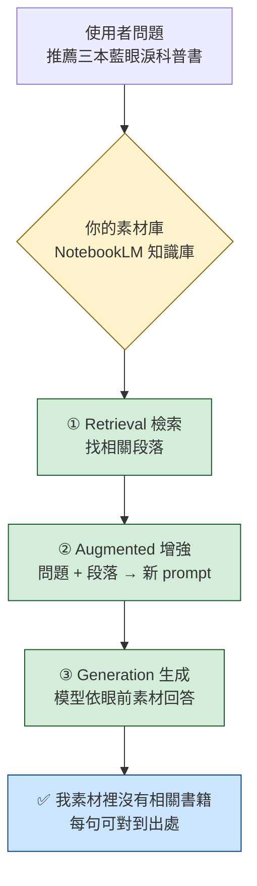
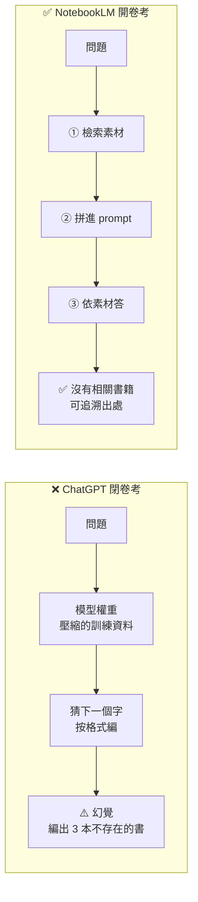

# RAG 流程示意圖（原理段壓軸用）

> **位置**：原理段「為什麼會幻覺，為什麼 NotebookLM 不會」壓軸段（19:40–20:25 內）
> **訴求**：3 秒看懂「為什麼 ChatGPT 會編、NotebookLM 不會」
> **不要做**：技術細節（embedding 維度、向量資料庫、cosine similarity 都不要）

---

## 版本 1｜純 RAG 流程（最簡潔，建議當主版投影片）

```
                    👤 使用者問題
                  「推薦三本馬祖藍眼淚科普書」
                          │
                          ▼
              ┌────────────────────────┐
              │  📚 你的素材庫          │
              │  (上傳到 NotebookLM)    │  ←─ 這就是「開卷」的書
              │  [PDF] [網頁] [筆記]   │
              └───────────┬────────────┘
                          │
                          ▼
              ╔════════════════════════╗
              ║  ① 檢索 Retrieval     ║
              ║   從素材中找相關段落    ║
              ╚═══════════╤════════════╝
                          │ 抓出 3-5 段最相關的內容
                          ▼
              ╔════════════════════════╗
              ║  ② 增強 Augmented     ║
              ║   問題 + 段落          ║
              ║   → 拼成新的 prompt    ║
              ╚═══════════╤════════════╝
                          │
                          ▼
              ╔════════════════════════╗
              ║  ③ 生成 Generation    ║
              ║   模型依「眼前素材」答 ║
              ╚═══════════╤════════════╝
                          │
                          ▼
                   ✅ 「我素材裡沒有相關書籍」
                      （每句都能對到出處）
```

**讀法（口稿）**：
- 「使用者問問題之前，模型先做兩件事——**檢索**、**增強**」
- 「檢索：從你給的素材裡，撈出最相關的段落」
- 「增強：把這些段落塞回問題裡，重新拼成 prompt」
- 「最後才生成——但這時模型『眼前』有素材，不再是憑空猜」
- 「**這就是 R.A.G.**——Retrieval Augmented Generation」

---

## 版本 2｜並排對比（最有戲劇張力，對應開場 demo）

```
┌─────────────────────────┐    ┌─────────────────────────┐
│  ❌ ChatGPT (無 RAG)     │    │  ✅ NotebookLM (有 RAG)  │
│  「閉卷考」              │    │  「開卷考」              │
└──────────┬──────────────┘    └──────────┬──────────────┘
           │                              │
   ┌───────▼───────┐              ┌───────▼───────┐
   │  問題          │              │  問題          │
   │  推薦三本書    │              │  推薦三本書    │
   └───────┬───────┘              └───────┬───────┘
           │                              │
           ▼                              ▼
   ┌───────────────┐              ┌───────────────┐
   │ 模型權重       │              │ ① 檢索素材    │
   │ (壓縮的訓練資料│              │ ② 拼進 prompt │
   │  → 只能「回憶」│              │ ③ 模型依素材答│
   └───────┬───────┘              └───────┬───────┘
           │                              │
           ▼                              ▼
   ┌───────────────┐              ┌───────────────┐
   │ 「猜下一個字」 │              │ 看到素材       │
   │  按格式編      │              │ 沒有書         │
   └───────┬───────┘              └───────┬───────┘
           │                              │
           ▼                              ▼
   ⚠️ 幻覺                         ✅ 「沒有相關書籍」
   編出 3 本不存在的書              可追溯到出處
```

**讀法**：兩邊同時投影，左邊紅色（幻覺）、右邊綠色（誠實）。觀眾左右掃一遍就懂。

---

## 版本 3｜Mermaid（HackMD / Notion / GitHub 可直接渲染）

````markdown

````

如果要做雙欄對比版的 Mermaid：

````markdown

````

---

## 版本 4｜Napkin / Keynote 重畫指引

如果要拿去 Napkin 或 Keynote 重畫成正式投影片，請給工具這段提示：

```
畫一張橫向流程圖，主題是「RAG（檢索增強生成）」

四個元素由上而下／由左至右：

1. 使用者問題（人形 icon）
2. 素材庫（書本或文件 icon，標記「你上傳的 PDF / 網頁」）
3. 三個處理步驟（並排或階梯狀）：
   ① 檢索 Retrieval（放大鏡 icon）
   ② 增強 Augmented（拼接 icon）
   ③ 生成 Generation（鉛筆 icon）
4. 答案（對話框 icon，標記「可追溯到出處」）

風格要求：
- 教學用，要簡潔，不要技術細節
- 中英對照標籤（每個步驟都有）
- 用箭頭明確標出資料流向
- 配色：橘黃（素材）／淺綠（處理）／淺藍（答案）

不要的元素：
- 不要 embedding、向量、cosine 等技術術語
- 不要寫程式碼、API、JSON
- 不要超過 5 個方框
```

---

## 講解時機與時間配置

> 都在原理段壓軸 13 min 內。

| 時機               | 顯示版本   | 時長  | 重點口稿                                   |
|--------------------|------------|-------|--------------------------------------------|
| 開頭「為什麼會幻覺」| 版本 2 左欄 | 5 min | 只看 ChatGPT 那邊，講「猜下一個」          |
| 切到「RAG 怎麼解」  | 版本 1     | 5 min | 帶觀眾走過三個方框，*重點是「素材在前」*  |
| 收尾「對教師意涵」  | 版本 2 全圖 | 3 min | 並排對比，回收開場那道書單題              |

---

## 投影片製作清單

- [ ] 主版（版本 1 或版本 3 Mermaid 第一個）
- [ ] 對比版（版本 2 或版本 3 Mermaid 第二個）
- [ ] 兩邊配色一致（紅色＝幻覺、綠色＝誠實）
- [ ] 字級夠大（馬高教室後排看得見）
- [ ] 確認「閉卷／開卷」這四個字在兩個版本都有出現——這是今晚的錨點比喻
