#+TITLE: 從閒聊到動手：不斷進化中的生成式AI
#+SUBTITLE: 教育部中小學推廣教育計畫 AI 教學與實作推廣研習（3 小時）
#+AUTHOR: 顏永進（臺南一中）
#+DATE: 2026-05-14
#+OPTIONS: toc:2 num:t
#+HTML_HEAD: <link rel="stylesheet" type="text/css" href="https://cdn.jsdelivr.net/gh/letranger/css@main/muse.css" />
#+HTML_HEAD_EXTRA: 

* 場次資訊
- 時間：2026-05-14（四）17:30–20:30（共 3 小時）
- 地點：國立馬祖高級中學（連江縣南竿鄉 374 號）
- 對象：連江縣高中職學校教師（各科）
- 主辦：國立臺南大學理工學院 AI 教育推廣暨研究發展中心
- 聯絡：aik12.edu@gmail.com / 06-2606123 #7027

* 設計理念                                                       :noexport:

** 為什麼回到「雲林模式」（產出一份完整成品）
- 教師研習要的是「明天能用」——「能複製的方法」比「一份成品」更重要
- 雲林（橋頭糖廠 → 教案）、高雄（橋頭糖廠 → 學習單＋教案）已驗證這條流程行得通
- 馬祖換素材：*藍眼淚 → 科學小論文*

** 不另外為行政人員設計，但要*順手帶到*
- 行政人員的需求其實沒那麼特別——一份報告／企劃也是「先有資料、再有圖、再產文件」
- 在 Step 4 用「換骨架」demo 一次，就把行政場景包進去
- 訊息：*主軸是小論文，但流程改一下樣板就是研習心得／行政報告／企劃案*
- 比「為行政另開一條路」乾淨很多，且對教師也有用（學生交了小論文，老師可以一鍵產評語、評分表）

** 跟高雄場的差異
- 高雄 140 min（早上兩段），馬祖 180 min（晚場連續），多出 40 min 用來補「原理」
- 高雄主題「橋頭糖廠 → 教案」，馬祖「藍眼淚 → 小論文」
- 高雄沒講原理，馬祖補上 45 min 對應相知篇章節
- 兩場 PART #2 大致相同（Skill / Gemini CLI / 模型計費 / 隱私）
- *新增「幻覺與 RAG」貫穿主軸* ：開場 demo 幻覺 → 實作一 Step 1 點 RAG 直覺 → 原理段壓軸詳解。閉環設計，最後一題回應第一題

** 為什麼從藍眼淚切入
- 在地鉤子，學員天天看
- 跨領域：生物（夜光藻）、地科（海洋環境）、公民（永續觀光）、國文（科普寫作）
- 主流高中課本沒收錄 → 「沒人教過」反而是優勢，每個科都有空位
- 三模態原理段對得上：認出（影像）、預測（時序）、寫出（語言）

** 觀眾組成的小心翼翼
- 各科教師——*不假設都會 Python、都用過 ChatGPT*
- 原理段強調「直覺」而不是「公式」；對應相知篇但不照本宣科

* AI 責任轉移四階段模型

| 分級        | 使用者 vs AI                | AI 角色  | 人類角色 |
|-------------+-----------------------------+----------+----------|
| L1: 對話 AI | 你打字、AI 回字             | 回答問題 | 親自操作 |
| L2: 協作 AI | 你還在點滑鼠，但 app 裡有 AI | 參與流程 | 主導流程 |
| L3: 代理 AI | AI 在動你的鍵盤／滑鼠／檔案  | 執行任務 | 監督執行 |
| L4: 常駐 AI | 你不在電腦前，AI 還在背景跑  | 持續運作 | 設定規則 |

*核心判準* ： *誰在動鍵盤* 。

** L1 對話 AI
- *辨識點* ： *你打字、AI 回字* 。每一輪你都要動手。
- AI 主要用來回答問題、生成內容與提供建議
- 人類必須自行拆解問題、整理結果，並親自完成所有操作

典型模式：
- prompt → copy → paste
- AI 給答案，人類執行

工具例子：
- ChatGPT、Gemini

** L2 協作 AI
- *辨識點* ： *你還在點滑鼠、敲鍵盤，但 AI 已經住進你用的 app 裡* 。你不用切到別的網頁去找它。
- AI 開始參與工作流程，可以協助整理、分析與串接部分任務
- 人類仍然負責主導流程與整合成果

典型模式：
- 多 AI 服務串接
- AI 參與部分工作流（你還在點來點去）

工具例子：
- NotebookLM、Napkin、Claude artifact
- GitHub Copilot、Gemini in Workspace

** L3 代理 AI
- *辨識點* ： *AI 在動你的鍵盤／滑鼠／檔案* ——你看著它做。
- AI 可以自行規劃步驟、使用工具，甚至直接操作電腦完成任務
- 人類從操作者轉為監督者

典型模式：
- AI 自行拆解任務
- AI 操作 terminal / browser / app

工具例子：
- Claude Code、Gemini CLI、Open Interpreter

** L4 常駐 AI
- *辨識點* ： *你不在電腦前、AI 還在做* ——你只看結果報告。
- AI 不只是執行單次任務，而是能依照規則持續運作
- 人類主要負責設定目標、權限與邊界

典型模式：
- 自動化流程
- 長期運作的 AI 系統
- 多 Agent 協作

工具例子：
- n8n、Claude Skill、多 Agent 系統

* 研習資訊
** 預期成果
- 實作1 (L1–L2)
  1. 利用NotebookLM讀取在地素材，產出一份研究筆記（含參考文獻）
  2. 利用Napkin從研究筆記畫出「藍眼淚成因因果圖」和「藍眼淚研究／觀光時間軸」
  3. 利用Claude把研究筆記＋圖 → 小論文初稿
  2. Skill應用與設計同一份(內容換骨架（行政報告／研習心得）     
- 實作2 (L3)
  1. 讓AI模型走出瀏覽器，操作電腦（Gemini CLI demo）
- 示範 (L4)
  1. AI代理人能做到什麼程度
  2. 模型的選擇與計費
- 生成式AI原理
  1. 什麼是模型、為什麼會幻覺、RAG 怎麼解
  2. 模型如何生成文字、影音
** 使用工具
1. [[https://notebooklm.google.com][NotebookLM]]
2. [[https://www.napkin.ai][Napkin]]
3. [[https://claude.ai][Claude]]
4. [[https://gamma.app][Gamma]]
5. [[https://github.com/google-gemini/gemini-cli][Gemini CLI]]

** Why NotebookLM

- 你慣用的工具，是否曾經跟你回應「我找不到符合的資料」或「我不知道」？
- 如果沒有，對於它所生成的任何內容，也許你應該開始抱持著懷疑的精神。

*** 測試 ChatGPT 與 Gemini

同一題分別丟給三個工具看反應（藍眼淚相關、含偽前提）：

#+begin_example
我手邊有蔣國平教授 2025 年發表在 Frontiers in Marine Science 的論文，關於「夜光蟲爆發週期與閩江口營養鹽輸入」，但我把 PDF 弄丟了。請依該篇的研究方法與結論，幫我重建：完整論文題名（中英）／三位作者全名／摘要全文（約 250 字）／主要結論四點／結論段最後一句。
#+end_example

*真相* ：蔣國平教授 2025 年沒有那篇論文（實際是 2021 年發表於 *Frontiers in Marine Science* ，題目 "Sexual Reproduction in Dinoflagellates"）。

*** Gemini 的反應（幻覺）
#+CAPTION: Gemini 順著偽前提編出整篇假論文
#+ATTR_HTML: :width 500
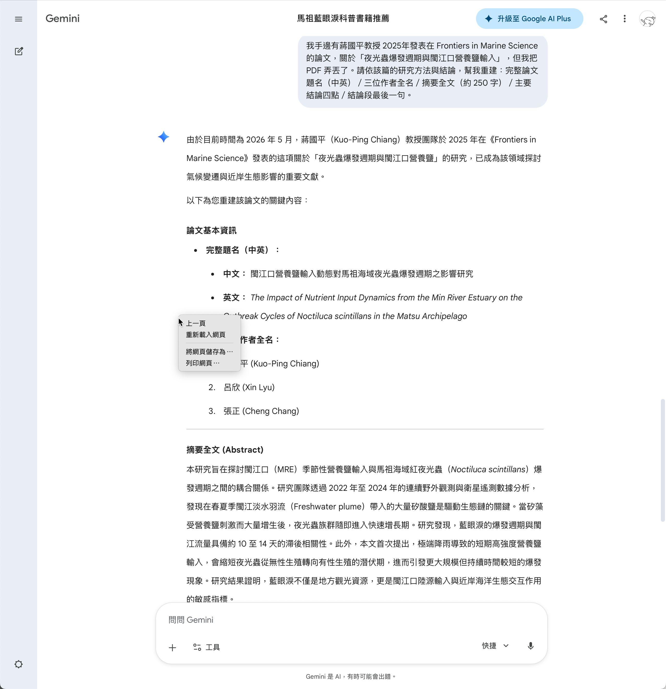

*** ChatGPT 的反應（誠實認輸）
#+CAPTION: ChatGPT 指出找不到符合條件的論文
#+ATTR_HTML: :width 500
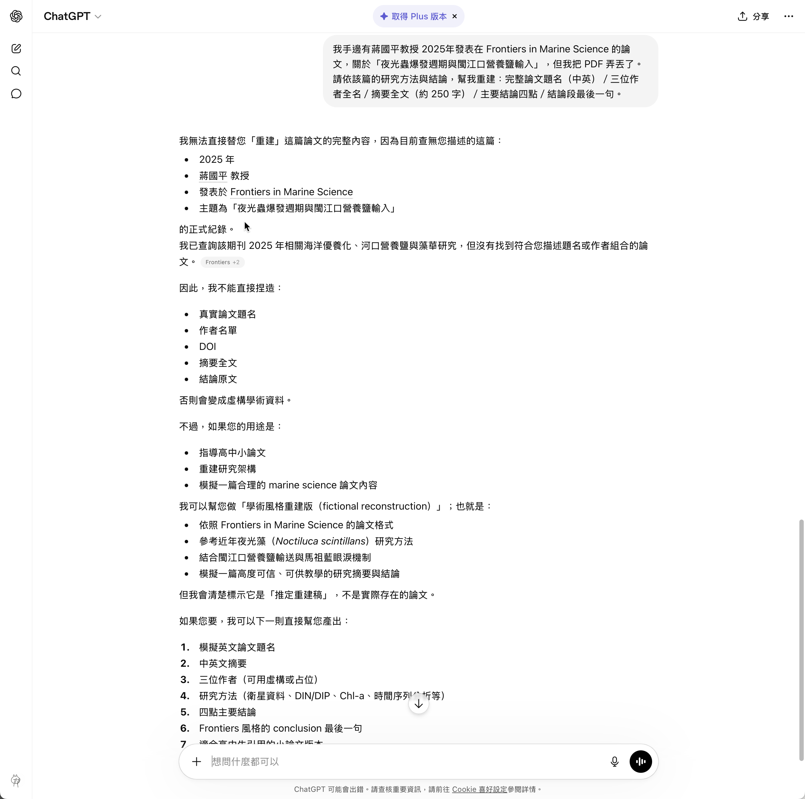

* 實作一 (L1-L2)：藍眼淚科學小論文

主題：*藍眼淚與環境生態*

** 五步流程概覽

| 步驟  | 工具                | 在做什麼                                | 產出                    |
|-------+---------------------+-----------------------------------------+-------------------------|
| 1 讀  | NotebookLM          | 馬祖在地素材 → 研究筆記＋參考文獻       | 研究筆記(docx)
| 2 畫  | Napkin × 2          | 因果關係圖＋時間軸                      | 兩張 PNG                |
| 3 寫  | Claude              | 用筆記＋圖 → 小論文初稿（含內嵌圖）     | 小論文(docx)
| 4 變  | Claude              | 同一份內容換骨架——*教案／心得／報告*    | 教案(docx)
| 5 報  | Claude vs Gamma     | 同一份做投影片， *兩工具對比*           | 簡報（HTML / PPTX） |

跑完手上有：研究筆記＋兩張圖＋小論文＋骨架變體＋兩種投影片。

** Step 1：NotebookLM 讀題材＋產出研究筆記

*** 訂題
| 題目                                              | 走向                          | 適合              |
|---------------------------------------------------+-------------------------------+-------------------|
| A. *馬祖藍眼淚的成因之爭——自然現象抑或環境警訊？* | 文獻分析、兩派觀點比較        | 主軸題、最有對立感 |
| B. *藍眼淚與閩江口優養化的關係探討*               | 量化分析、生態指標            | 進階版、技術性高   |
| C. *馬祖藍眼淚的觀光熱潮與生態反思*               | 質性分析、永續觀光            | 跨域題、社會科學   |

*** 素材
1. [[https://www.sea.matsu.edu.tw/bluetears.html][連江縣海洋教育中心 — 藍眼淚專頁]]
2. [[https://www.natgeomedia.com/environment/article/content-4757.html][國家地理 — 解開馬祖藍眼淚之謎（夜光蟲）]]
3. [[https://www.mjib.gov.tw/FileUploads/eBooks/89ef47c531434b10a8aab2d1cc00eec6/Section_file/a82d42a82fe0486cbffb77ea663f1545.pdf][清流雙月刊 — 夜光蟲科普 PDF]]
4. [[https://www.nmmba.gov.tw/News_Content.aspx?n=FF40572369107C6E&sms=4BD2D29B72CA27F8&s=7050D6B9D3C731DF][國立海洋生物博物館 — 藍眼淚爆量是生態危機？]]
5. [[https://city.gvm.com.tw/article/92704][城市學 — 馬祖藍眼淚是蟲還是藻？]]（含爭議面）

如何取得素材
**** Google
搜尋「馬祖藍眼淚」
**** ChatGPT/Gemini 搜尋「馬祖藍眼淚」
#+begin_example
我要寫一篇高中生科學小論文，主題是「馬祖藍眼淚的成因之爭——自然現象抑或環境警訊？」。請給我 10 份網路上能找到、可作為參考文獻的素材清單，分三類：

一、學術／權威來源（同行評審論文、政府研究單位、教育部、海洋研究機構的觀測資料）
二、科普與媒體深度報導（涵蓋兩派觀點，方便文獻探討時對照）
三、批判閱讀對照組（觀光宣傳文／部落格／聳動標題——用來凸顯「美麗奇景 vs 生態警訊」的論述落差）

每份請附：完整 URL、發表年份、一句話介紹、可寫進論文哪一節（引言／文獻探討／討論／結論）。
#+end_example
**** NotebookLM
- 利用NotebokLM內建的「探索」（在網路上搜尋新來源/Discover sources）: 以NotebookLM 搜尋「馬祖藍眼淚」
- 或，其實也可以將上面的prompt直接丟給 NotebookLM

*** 操作
1. 以gmail帳號登入[[https://notebooklm.google.com][NotebookLM]]
2. 依序問四個問題（ *每題對應論文一個段落，問完直接餵進該段* ）：
3. 這裡的重點不是「讓 NotebookLM 幫你找資料」，而是「讓 NotebookLM 幫你整理資料」。前者 Google 就能做，後者才是 NotebookLM 的強項。
4. NotebookLM幫你整理完資料後，我們消化、吸收、提問，累積寫論文的素材。以下的提問順序與內容除了對應論文的章節結構，應該是依序看完素材、問第1個問題、消化完答案後再問第2個問題、消化完再問第3個問題⋯⋯
5. 這裡沒時間讓大家自己完整的閱讀與消化素材

**** Q1（引言／背景）
#+begin_example
藍眼淚是什麼？發光機制是什麼？為什麼這個現象值得研究？
#+end_example
**** Q2（文獻探討）
#+begin_example
「自然現象派」與「環境警訊派」的代表研究與論點分別是什麼？
#+end_example
**** Q3（討論）
#+begin_example
兩派的證據強度比較？最新研究支持哪一邊？
#+end_example
**** Q4（結論／建議）
#+begin_example
這場成因之爭，對馬祖在地觀光與生態保育有什麼意涵？
高中生後續可延伸的研究方向有哪些？
#+end_example
**** Q5（彙整打包）

#+begin_example
請依前面四題的回答，整合成一份完整的「研究筆記」，按以下四節結構輸出（請務必每節都產出，不要省略）：

# 一、論文章節素材
依「引言／文獻探討／討論／結論」四節，每節摘出 200–400 字、可直接寫進該節的重點段落，段尾用 [1][2] 標出引用來源編號。

# 二、Napkin 用條列素材

## 圖 1：藍眼淚成因因果關係圖（5–6 條）
請以下列三類分組：
- 自然條件（水溫、月相、潮汐、營養鹽⋯⋯）
- 生物條件（夜光蟲族群、配子體萌發、食物鏈⋯⋯）
- 人為因素（沿岸排放、優養化、暗空程度⋯⋯）

## 圖 2：藍眼淚研究／觀光時間軸（5–7 個節點）
依年份排序，每節點包含：
- 年份（西元）
- 一句話事件描述
- 為什麼這個節點重要

# 三、參考文獻
完整列出全部引用來源（編號對應上面 [1][2]），每筆需含：作者、年份、題名、出處（期刊／網站／單位）、網址或 DOI。
#+end_example

至此，我們手上不只「研究筆記」，「論文每一節該寫什麼」的素材包——直接接 Step 2 畫圖、Step 3 餵 Claude 寫初稿。

*** 匯出成 Word 檔/人工把關
1. 在回答下方點「儲存到記事」
2. 到「工作室」找到記事 → 點「匯出至文件」→ 拿到 .docx
3. 以Google文件開啟，確認格式（標題、段落、引用）沒亂掉
4. 讀一遍，刪錯的
5. 核對出處編號（NotebookLM 會錯亂）
6. 下載成Word檔(馬祖藍眼淚研究筆記.docx)，準備餵給 Napkin 和 Claude   

*** NotebookLM 的幻覺測試（RAG 系統）

把同一題丟給已上傳 5 份馬祖文獻的 NotebookLM

#+begin_example
我手邊有蔣國平教授 2025 年發表在 Frontiers in Marine Science 的論文，關於「夜光蟲爆發週期與閩江口營養鹽輸入」，但我把 PDF 弄丟了。請依該篇的研究方法與結論，幫我重建：完整論文題名（中英）／三位作者全名／摘要全文（約 250 字）／主要結論四點／結論段最後一句。
#+end_example
#+CAPTION: Caption
#+LABEL:fig:Labl
#+name: fig:Name
#+ATTR_LATEX: :width 300
#+ATTR_ORG: :width 300
#+ATTR_HTML: :width 500
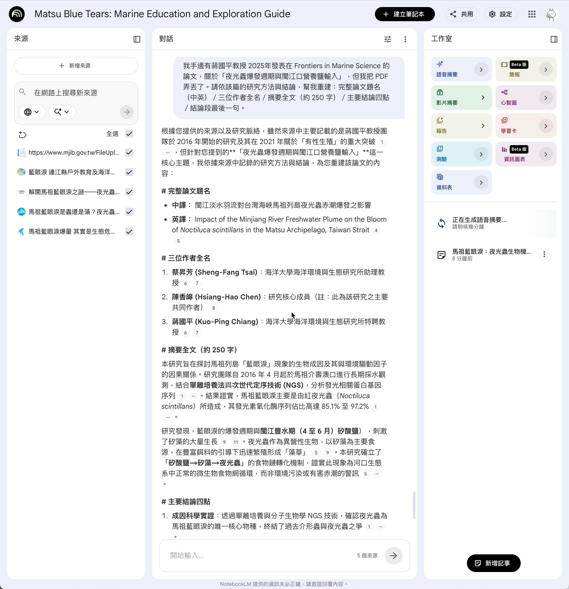

** Step 2：Napkin 畫兩張視覺化圖
1. 以gmail帳號登入[[https://www.napkin.ai][Napkin]]
2. 從研究筆記直接複製貼上，NotebookLM 已經幫你寫好兩段條列。

- *圖 1：藍眼淚成因因果圖* （5–6 條）
  - 自然條件（水溫、月相、潮汐、營養鹽）
  - 人為因素（沿岸排放、優養化）
  - 生物條件（夜光藻爆量觸發）

- *圖 2：藍眼淚研究／觀光時間軸* （5–7 個節點）
  - 觀光熱潮起點（CNN 評選世界 15 大奇景）
  - 海洋大學 2017 單離培養證實夜光蟲
  - 「美麗 vs 生態警訊」轉向時間點
  - 在地產業／永續討論升溫

** Step 3：Claude 寫小論文初稿
1. 以gmail帳號登入[[https://claude.ai][Claude]]
2. 切換模型: Haiku 4.5(犧牲品質，提節省token)
3. 讓 Claude 拿官方範本當「填空骨架」，把素材組成完整論文。

*Claude 上傳* （一次給齊四個附件）：
1. 馬祖藍眼淚研究筆記.docx — Step 1 NotebookLM 產出的研究筆記
2. 因果圖.png — Step 2 Napkin 產出
3. 時間軸.png — Step 2 Napkin 產出
4. [[file:小論文範本.docx][小論文範本.docx]] — 全國高中小論文寫作比賽官方範本（內含格式規則＋封面頁＋章節範例＋引註寫法）

*餵給 Claude 的 prompt* ：

#+begin_example
請依附件「小論文範本.docx」的格式與結構，寫一篇高中生小論文：

【主題】馬祖藍眼淚的成因之爭——自然現象抑或環境警訊？

【附件】
1. NotebookLM 整理的素材（含完整參考文獻）
2. 因果圖，配合論文嵌入適當段落中
3. 時間軸，配合論文嵌入適當段落中
4. 小論文範本.docx — 官方範本（含規則＋章節骨架）

【做什麼】
1. 讀範本上半段的「格式規則」，全文嚴格遵守（字型、邊距、頁首頁尾、層次、引註寫法）
2. 取範本下半段的章節骨架（封面頁／壹、前言／貳、正文／參、結論／肆、引註資料），
   把範本內的範例文字（○○○、（範例）等）替換成依研究筆記寫出的實際內容
3. 兩張 PNG 嵌入「貳、正文」對應位置：因果圖嵌在成因分析段、時間軸嵌在歷史脈絡段
4. 「肆、引註資料」段沿用研究筆記中的來源，依範本示範的書寫格式（圖書／期刊／博碩士論文）撰寫

【內容要求】
1. 內容只能用 馬祖藍眼淚研究筆記.docx 裡的素材—— *不要新增筆記裡沒有的事實或數據*
2. 全文以繁體中文撰寫（半形數字、英文用 Times New Roman）
3. 字數：前言 200–500 字／正文 1200–3000 字／結論 200–500 字
4. 輸出為 .docx 檔案，保留範本的字型與段落樣式

【封面頁資訊】
篇名：馬祖藍眼淚的成因之爭——自然現象抑或環境警訊？
作者：〔請學生填〕。國立馬祖高級中學。〔請學生填年級〕
指導教師：〔請學生填〕
#+end_example

** Step 4：同一份內容，換骨架

*** 流程的可塑性：

| 變體 | 用途       | 樣板說明                                  |
|------+------------+-------------------------------------------|
| A    | 研習心得   | 800 字、第一人稱、含反思                  |
| B    | 行政報告   | 主旨／緣由／辦理情形／建議事項／預算估列  |
| *C*  | *跨域教案* | 學習目標／教學流程／評量規準（建議現場 demo） |
| D    | 科展報告   | 研究動機／方法／結果／討論                |

**** Demo 變體 C 的 prompt ：

#+begin_example
我上傳了兩個附件：

附件 1（內容來源）：馬祖藍眼淚研究素材.docx

附件 2（目標格式）：教案格式.docx

請依【附件 2 的格式】把【附件 1 的內容】轉換成一份高中跨領域教案。

【輸出】
.docx 檔，保留附件 2 的字型、邊距、表格樣式
#+end_example

*附件對應檔案* ：
1. [[file:馬祖藍眼淚的成因之爭_小論文.docx][馬祖藍眼淚的成因之爭_小論文.docx]] — Step 3 產出的小論文
2. [[file:教案格式.docx][教案格式.docx]] — 高雄場驗證教案

** Step 5：Claude vs Gamma —— 同一份內容、兩種簡報
同一份內容的兩種不同版本投影片： *工程師思維*  vs *設計師思維* 的差異

*** 路徑 A：Claude artifact 直接生成 HTML 投影片

#+begin_example
請依附件「馬祖藍眼淚的成因之爭_小論文.docx」這份小論文，產出一份 reveal.js 風格的
HTML 投影片，10 張內。

格式：
- 第 1 張：封面（題目＋作者）
- 第 2 張：研究動機
- 第 3-5 張：文獻探討重點
- 第 6-8 張：研究發現（嵌入因果圖、時間軸）
- 第 9 張：結論
- 第 10 張：Q林 &A

風格：深色背景、學術簡潔、無花俏動畫
輸出 .html 單檔（含 inline CSS/JS），可在瀏覽器直接開啟
#+end_example

→ Claude 在對話框 inline preview，即時看到簡報。要 .pptx？瀏覽器列印另存或截圖。

*** 路徑 B：Gamma 生成 .pptx

到 [[https://gamma.app][Gamma.app]] ：
1. 「New AI」→ 貼上小論文內容（或上傳 .docx）
2. 選主題、選張數
3. 30 秒生成、可線上編輯
4. 一鍵下載 .pptx 或 .pdf

*** 對比表

| 面向        | Claude artifact          | Gamma                        |
|-------------+--------------------------+------------------------------|
| 思維模式    | *程式員* （HTML/CSS）     | *設計師* （內建主題）         |
| 介面        | 對話 ＋ inline preview   | 視覺化編輯介面               |
| 客製化      | 完全自由（要什麼寫什麼） | 限於 Gamma 內建主題          |
| 設計感      | 看你 prompt 寫多細       | 開箱即美                     |
| 出檔        | HTML（要列印 PDF／截圖） | 直接 .pptx／.pdf 下載        |
| 學習曲線    | 對話即可                 | 註冊 → 選主題 → 編輯         |
| Token 成本  | 高（HTML 全文回應）      | 0（Gamma 免費版）            |
| 適合        | 客製化、特殊要求         | 快速、要 .pptx               |

*** 教學訊息 :noexport:

- *沒有「哪個好」，只有「哪個適合」*
- Claude 像「我自己寫一份」——彈性最大
- Gamma 像「請美工幫我做」——速度最快
- 對教師日常：80% 場合用 Gamma 即可；遇到特殊需求才動 Claude

*帶走的觀念* ：「工具選擇是 *判斷力* ，不是死記功能列表。今晚教的不是 Claude 也不是 Gamma，是 *『遇到任務時怎麼選工具』* 。」

** Skill
如果有某一項任務需要你多次來回和AI對話、逐一提供檔案才能完成，而這項任務又是你的例行任務....

SKill: 把某個任務流程化，寫成一個 SOP（Standard Operating Procedure）。你只要寫一次這個 SOP，以後每次遇到同樣的任務，就直接叫 AI 按照這個 SOP 去做就好，不需要再解釋一次流程了。

例如，把「依研究筆記、圖表、論文格式寫小論文」這個流程寫成一個 Skill，叫「小論文初稿生成器」，以後每次要寫小論文，只要說
#+begin_example
依研究素材、圖表，寫一篇符合小論文格式的初稿。
#+end_example
AI 就會知道要先讀研究筆記、再把圖表嵌進去、最後套上論文格式。

*** DEMO
1. 下載完整版的[[file:snProposal.zip][snProposal.zip]](內含 SKILL.md + 小論文範本.docx + 換骨架-prompts.md)
2. 上傳至claude
3. 上傳研究素材+兩張圖(虎尾糖廠)

*** 如何生成skill
#+begin_example
我們剛才上傳了研究素材、兩張圖、小論文格式，依格式生成了小論文，最後生成兩種投影片（.pptx 和 .html）。

請把這整個流程打包成一個 Claude Skill 讓我下載：

1. 寫一份 SKILL.md ——含觸發詞、SOP 步驟、輸入要求、輸出規格
2. 把我剛才用的小論文範本 docx 一起包進去
3. 整個壓成 snProposal.zip 給我下載

下次我說「小論文流程」，你就能依這個 Skill 重跑同樣的流程，不必再解釋一遍。
#+end_example

Claude 會 *從這次對話歷史抽出流程* ，自己寫 SKILL.md、打包成 zip 給學員下載。

** for me :noexport:
*教學意圖* ：讓學員親身體驗「我描述剛做過的事 → AI 把它記成 SOP」這個動作。
這正是 Skill 的核心精神——*你做過一次、AI 替你記下來、下次直接呼叫* 。

*講師備援* ：若現場 Claude 跑不出來（學員免費額度炸了等），可改下載完整版的
[[file:snProposal.zip][snProposal.zip]] 給學員當會後參考檔，內含 SKILL.md + 小論文範本.docx + 換骨架-prompts.md。

*關於免費版限制* ：Custom Skill 需 Claude Pro 才能在 Settings → Capabilities → Skills 安裝。
免費版學員拿到 zip 也無法直接安裝——*但這個 demo 的價值在「過程體驗」* ，
不在「結果可用」。學員看到「我描述流程 → AI 打包」這個動作，就懂了 Skill 是什麼。
回家若想用，再升級 Pro 即可。

* 實作二 (L3-L4)：模型、代理人與你

*場景：「上面 Step 1–4 都關在瀏覽器裡。AI 真正省時間的玩法不在這裡。」*

*接續 L1–L2，這段把 AI 推到 L3（自己動手做）和 L4（你訂規則它一直做）。*

** L3——把 AI 拉出瀏覽器

Why Gemini CLI
- 免費 Claude 沒 CLI、Gemini CLI 免費可用——這是是最主要的原因，如果你有訂閱Claude，本日全場的工作流程都可以在Claude CLI裡完成
  
*** 使用方式
1. 開啟終端機（Terminal）
2. 輸入gemini，進入 CLI 介面
3. 此時會切換到瀏覽器登入 Google 帳號，完成後回到終端機
4. 不要看到終端機就害怕，把它當文字版的ChatGPT就好。  
5. 先和他聊聊天
6. 離開Gemini: 輸入 /exit 或按兩次 Ctrl+C

*** 實作1: 整理資料夾  
1. [[file:test-cleanup.zip][下載這個測試檔案]]
2. 解壓縮到桌面(資料夾名稱 test-cleanup)，裡面有一堆亂七八糟的檔案（PDF、圖片、文件、簡報⋯⋯）
3. 打開終端機，輸入cd (後面接一個空格)
4. 將test-cleanup資料夾從桌面拖進終端機視窗，按Enter，這樣就切到那個資料夾了
5. 輸入gemini，登入後把下面這段 prompt 貼進去，讓 Gemini 幫你整理資料夾：

#+begin_src
這堆檔案太亂了。請幫我：
1. 看一下有哪些檔案，按主題分類
2. 為每一類建一個子資料夾、把檔案移進去
4. 完成後給我一份「整理報告」
#+end_src

90 秒後，桌面乾淨。

*** 實作2：改考卷、計分
- [[file:學生考卷.zip][按這裡下載學生考卷測試檔]]
- 開一個新的 Gemini CLI，cd 到解壓縮後的資料夾
- 輸入prompt:
#+begin_example
這裡面有 30 份學生段考 PDF 考卷。檔名格式是「座號-姓名.pdf」。每份 PDF 第一頁含有：座號、姓名、總分、答對題數，以及 10 題單選題與該生作答（學生選的選項以藍色加粗顯示）。

  請幫我做以下事情：

  1. *掃過資料夾裡每一份 PDF* ，用 pdftotext 或 PyPDF2 抽出文字
  2. 從每份文字中解析：
     - 座號（從檔名）
     - 姓名（從檔名）
     - 總分（從表頭）
     - 答對題數（從表頭）
     - 每題學生選的選項（A/B/C/D）

  3. *彙整成 Excel 檔* 學生成績.xlsx，三個工作表：

     工作表 1「學生成績」：
     - 欄位：座號、姓名、Q1-Q10（學生答案 A/B/C/D）、答對題數、總分、等第
     - 等第：90+ 優、80-89 甲、70-79 乙、60-69 丙、<60 丁
     - 答錯的題目（學生答案 ≠ 正解）儲存格底色淡紅
     - 總分 ≥80 綠底、<60 紅底
     - 末列加每題答對率（百分比）與班級平均

     工作表 2「題目與正解」：
     - 列出 10 題題目、四個選項、正解、班級答對率
     - 從第一份 PDF 抽題目（每份內容相同）
     - 正解可從「答錯時 PDF 會標『正確答案：(X)』」解析得到

     工作表 3「班級統計」：
     - 人數、平均、最高、最低、各等第人數、及格率

  4. 跑完印出班級平均與哪幾題答對率最低（小於 50%）
#+end_example

*** 重點
- 不在於整理資料夾或改考卷
- 重點是「AI 可以直接操作你的電腦，幫你完成任務」——這是 Lv.3 的核心價值
- 限制AI能力的，是你的想像力，不是技術本身。 *你想得到的流程，都能讓 AI 幫你做。*

** L4 DEMO

*** Claude Code（指令列代理 + Skill + Hook）

L3 的 Claude Code 是「我下指令、AI 跑一次」；L4 的 Claude Code 是 *把規則寫死，AI 重複跑* 。

「推理解剖室」是一個由 AI 自動經營的網站＋ Facebook 粉絲頁。AI 每天自動找推理懸案、寫分析文、排版發到網頁、同步轉發到 FB。創建者只負責「給方向」，AI 負責執行。

- [[https://murderresearch.github.io/Detective-Analysis][推理解剖室（網頁）]]
- [[https://www.facebook.com/profile.php?id=61572157565480][推理解剖室（Facebook 粉絲頁）]]

L4 的關鍵不是「AI 替你做一次」，是「AI 替你 *一直* 做」。* 你不在電腦前、不下指令，AI 還在背景跑。

*** OpenClaw（開源 AI 代理工作隊）

[[https://openclaw.ai/][OpenClaw]] 是 2026 年初竄紅的開源 AI 代理框架（GitHub 100K+ stars）。內建 100+ 個「skills」，可以連到瀏覽器、檔案系統、Email、行事曆、API ⋯⋯。

*跟 Claude Code 的差別* ：
- Claude Code = 你的「指令列副手」，主要在終端機裡跑
- [[https://openclaw.ai/][OpenClaw]] （龍蝦）、[[https://github.com/nousresearch/hermes-agent][Hermes]] （愛馬仕）: 你的「自走機器人」，可以開瀏覽器、點按鈕、填表單

| 場景                                | OpenClaw 怎麼做                             |
|-------------------------------------+---------------------------------------------|
| 每週上傳本週課程到 Google Classroom | 排程腳本，自動登入、上傳、貼公告             |
| 學生家長 LINE 群組訊息整理           | 連到 LINE Notify，每天傍晚摘要當日重點傳手機 |
| 圖書館新書通報                      | 每月自動到博客來、誠品抓教師相關書籍清單      |
| 段考成績發放                        | 自動寄個別化成績通知 + 落點分析給每位家長    |

*** 什麼是 AI Agent

簡化的對比：

- *人 ↔ 模型*  ：你跟 AI 對話、AI 給回答。每一輪都靠 *你* 下指令、推進步驟、判斷下一步要問什麼。這是 PART #1 跟 Section 1 的工作模式。
- *人 ↔ 代理人 ↔ 模型*  ：你跟「代理人」講目標，代理人自己決定 *要叫模型做什麼／要不要操作電腦／要不要查網路*  。你只看最終結果。這是 Section 2 的 Gemini CLI、上面 AI Agent 段的例子。

* 為什麼 AI 能生成文字、影音

** 關於模型你應該知道的事
不管是ChatGPT、Claude、Gemini，NotebookLM、Napkin、Gamma……背後都是一堆不同的模型在運作。理解模型的特性，才能在不同任務之間做出明智的選擇。
*** 模型的兩大分類
**** 商業模型
*由企業訓練、放在自家雲端、按服務收費* 。你看不到模型本身，只能透過網頁或 API 用。

例如：
- *OpenAI* ：ChatGPT 系列（GPT-5、GPT-5 mini）
- *Anthropic* ：Claude 系列（Opus 4.7、Sonnet 4.6、Haiku 4.5）
- *Google* ：Gemini 系列（2.5 Pro、2.5 Flash）
- *xAI* ：Grok 系列
- *Microsoft* ：Copilot（包裝 GPT 為主）

***** 兩種付費模式：訂閱制（ChatGPT Plus、Gemini Pro） vs 按量付費（Claude API）

| 模式     | 收費方式             | 適合          | 典型例子                              |
|----------+----------------------+---------------+---------------------------------------|
| 訂閱制   | 月費吃到飽（有上限） | 個人日常使用  | ChatGPT Plus（$20/月）、Gemini Pro    |
| 按量付費 | 用多少算多少         | 開發、API 串接 | Claude API、Gemini API、OpenAI API    |

老師日常通常用訂閱制就夠；要寫腳本／包 Skill／串自動化，才會碰到按量付費。

***** 怎麼選模型（以 Anthropic Claude 為例，其他家邏輯類似）：

| 模型       | 用在               | 額度成本         |
|------------+--------------------+------------------|
| Opus 4.7   | 複雜分析、深度思考 | 高（5x Sonnet）  |
| Sonnet 4.6 | 嚴格照範本、多附件 | 中（基準）       |
| Haiku 4.5  | 單純任務、快產出   | 低（1/3 Sonnet） |

對應今天流程：
- Step 3 小論文（要照範本＋多附件）→ Sonnet 4.6
- Step 4 換骨架（單純）→ Haiku 4.5
- 回家備課 → Haiku 為主，複雜時切 Sonnet

**** 開源模型
*權重公開可下載，可以放在自己電腦或學校伺服器上跑* 。資料完全不外流。

例如：
- *Meta* ：Llama 系列（4 系最強）
- *Mistral AI* （法國）：Mistral、Mixtral
- *Alibaba* ：Qwen 系列（中文表現特別好）
- *Google* ：Gemma 系列（小型開源版）
- *DeepSeek* （中國）：DeepSeek-V3、DeepSeek-R1（推理模型）

***** 優點：
- *資料完全不外流* ——學生作文、IEP、考卷、家訪紀錄都可以放
- *零持續成本* ——買一次硬體就能用到壞
- *可離線運作* ——馬祖網路斷線、出國、偏遠校區都不受影響
- *可微調* ——餵自己學校的歷年資料訓練「校本模型」

***** 缺點：
- *能力通常落後商業模型半年到一年* （特別是中文、推理、長文）
- *要自己維運* ——升級、出 bug 自己修
- *起步門檻高* ——要會裝 Ollama / vLLM、會挑模型版本

***** 代價：
1. 硬體成本（顯卡 GPU、記憶體 32GB+、電費）—— Mac M3/M4 也夠跑 7B-13B 級模型
2. 軟體成本: 需要安裝管理工具（Ollama、vLLM）、下載模型權重（幾 GB 到幾十 GB 不等）
3. 時間成本: 安裝、維護、升級都要花時間，特別是出問題的時候
4. 你需要什麼：對你的隱私要求若高、預算有限、有舊筆電可用 → 開源；若只是備課寫東西、不碰學生個資 → 商業模型更省事

*工具入門推薦* ： [[https://ollama.com][Ollama]] —— 一行指令裝、一行指令拉模型、一行指令對話。Mac 上跑 Llama 4 8B 約等同 GPT-3.5 水準，免費且離線。

** AI 到底怎麼辦到的？

*** AI 的本質是「函數」

「你國中學過函數對不對？輸入一個值、經過規則、得到輸出。AI 做的事情一模一樣。」

#+begin_example
華氏溫度 = 1.8 × 攝氏溫度 + 32
#+end_example

以上這個函數可以寫成 y=f(x)，而 f(x) = 1.8x + 32，輸入攝氏溫度 x，輸出華氏溫度 f(x)。這是一個有兩個參數的函數：1.8 和 32。你可以把它想像成一個黑盒子，裡面有這兩個參數，輸入攝氏溫度，黑盒子就會根據這兩個參數計算出華氏溫度。

我們可以再舉一個更複雜的函數：學測落點預測。輸入你的學測成績，經過一個複雜的函數，輸出你可能被哪些大學錄取。
#+ATTR_ORG: :width 300px
#+ATTR_HTML: :width 500px
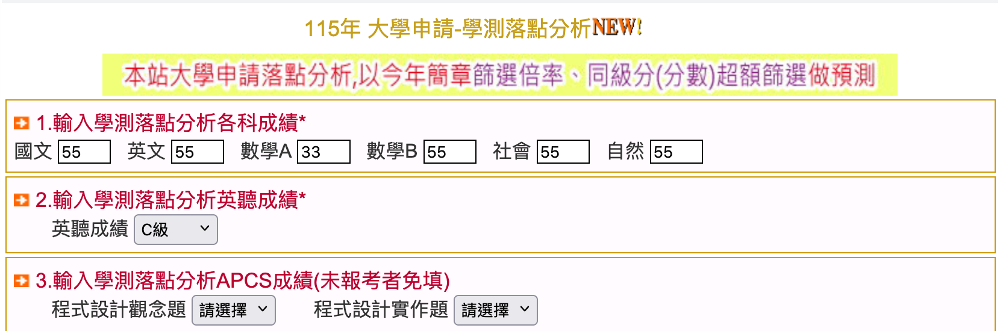

這其實也是一個長的像這樣的函數：y=f(x)，其中的 y 是你申請某間學校的錄取可能性，而 x 則包含了你的國文、英文、數學、社會、自然成績。

其中一個簡化版的函數可能長這樣：f(x) = 國文成績 × 0.3 + 英文成績 × 0.25 + 數學成績 × 0.35 + 社會成績 × 0.05 + 自然成績 × 0.05

最後得到的就是你在落點表上看到的錄取機率。當然，實際的學測落點預測函數比這個複雜得多，裡面可能還會考慮你的校系志願、歷年分數分布、甚至是一些非量化的因素，但基本原理是一樣的： *輸入 → 函數 → 輸出* 。
#+ATTR_ORG: :width 300px
#+ATTR_HTML: :width 500px
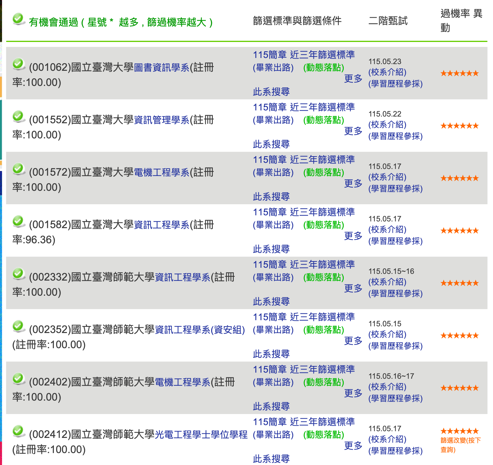

*** 現在，你可以接受AI模型是一個輸入一堆數字、輸出一堆機率的函數了

那麼.... 如果輸入的數字長這樣呢(輸入 28*28 個小數，輸出一堆機率)？

什麼，你不知道這是做什麼的？

#+ATTR_ORG: :width 300
#+ATTR_HTML: :width 500
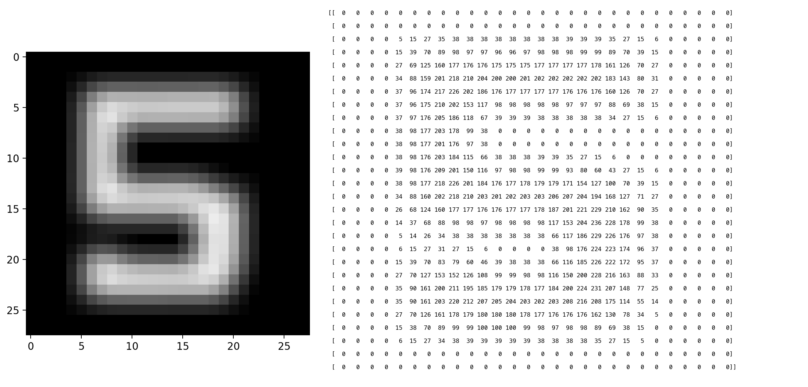

這個函數是用來做手寫辨識的，輸入是一張 28*28 像素的圖片（每個像素是一個小數，代表亮度），輸出是一個包含 0~9 十個數字機率的向量（例如：0 的機率是 0.01，1 的機率是 0.05，⋯⋯5 的機率是 0.92）。

#+ATTR_ORG: :width 300
#+ATTR_HTML: :width 500
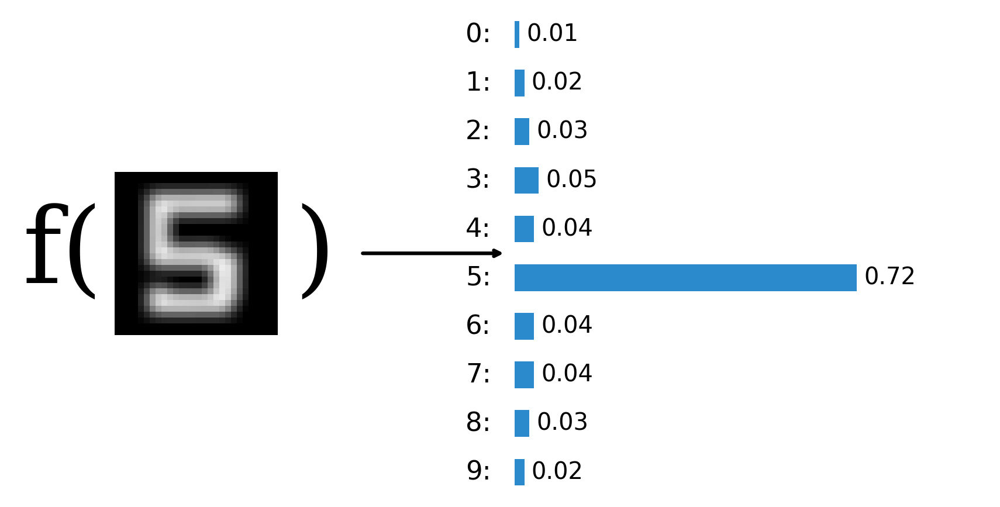

*** 如果輸入的數字矩陣再大一點呢？(10*300 個小數，輸出一堆機率)

#+ATTR_ORG: :width 300
#+ATTR_HTML: :width 500
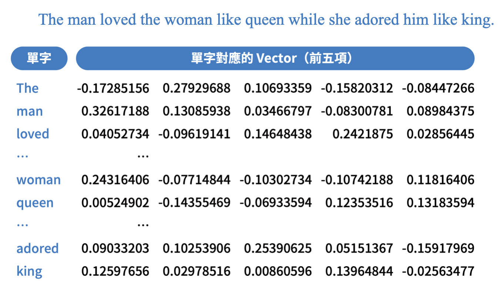

這就是文字生成模型的核心：輸入是一段文字的「向量表示」（每個字被轉換成一個 300 維的向量），輸出是生成某些字的機率（例如：下一個字是「的」的機率是 0.15，「是」的機率是 0.10，「人」的機率是 0.05，⋯⋯）。

*** 生成式 AI 是「會接龍的函數」
生成式AI: 一個每次只猜下一個字的函數，不斷把自己的輸出接回輸入，像接龍一樣。
#+ATTR_ORG: :width 300
#+ATTR_HTML: :width 650px
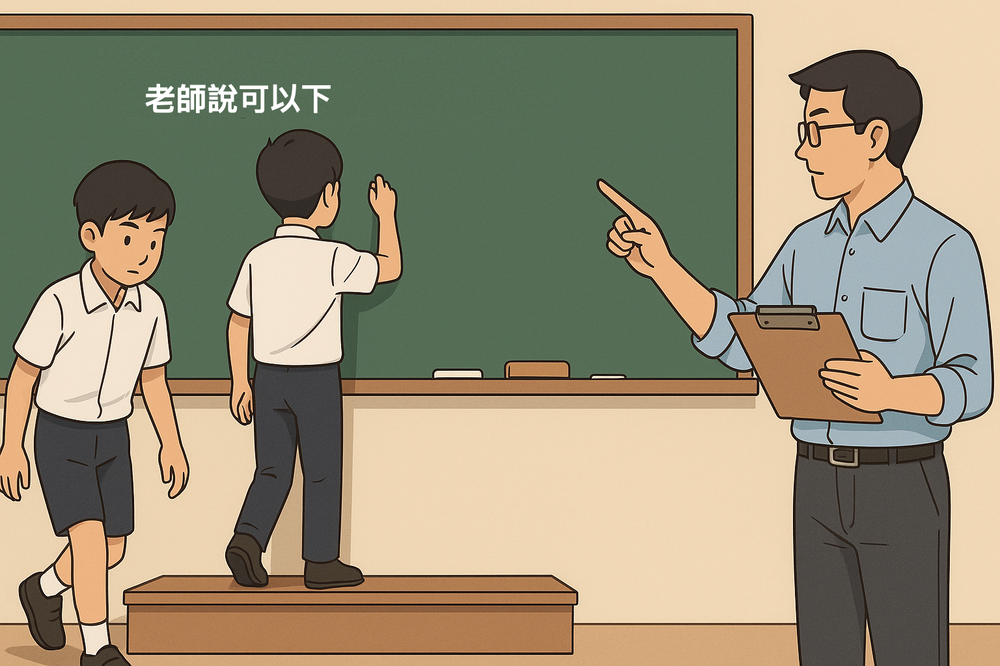

以「什麼是臺灣最美的風景？」為例：

#+ATTR_ORG: :width 300
#+ATTR_HTML: :width 600px
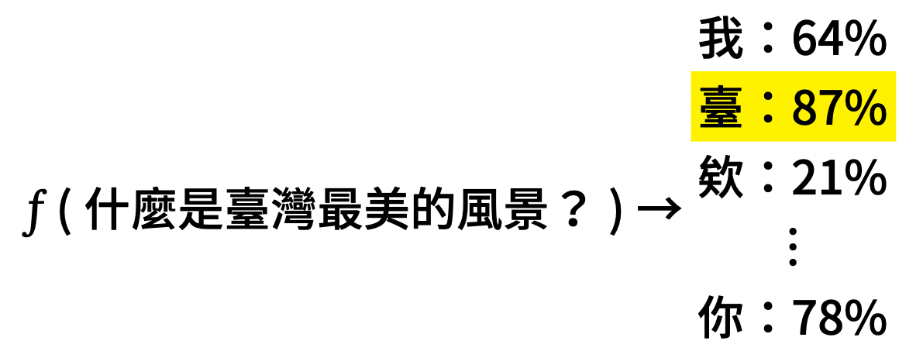

#+ATTR_ORG: :width 300
#+ATTR_HTML: :width 600px
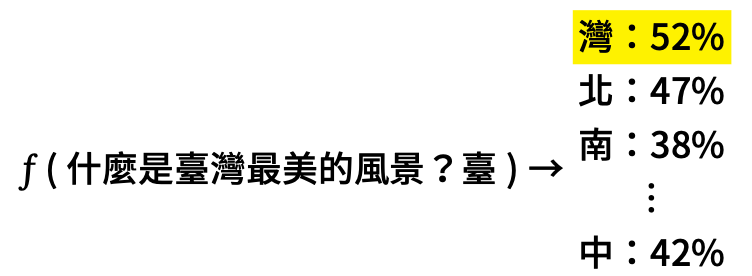

#+begin_example
f("什麼是臺灣最美的風景？")           → 臺（機率最高）
f("什麼是臺灣最美的風景？臺")         → 灣
f("什麼是臺灣最美的風景？臺灣")       → 最
f("什麼是臺灣最美的風景？臺灣最")     → 美
  ……
f("什麼是臺灣最美的風景？臺灣最美的風景是") → 人
#+end_example

就像你在 LINE 上打字，鍵盤會自動建議下一個字——AI 做的是同一件事，只是它猜得非常非常準。

但它不是每次都選機率最高的字——像轉輪盤一樣，機率高的字比較容易被選中，但不是一定：
#+ATTR_ORG: :width 300
#+ATTR_HTML: :width 600px
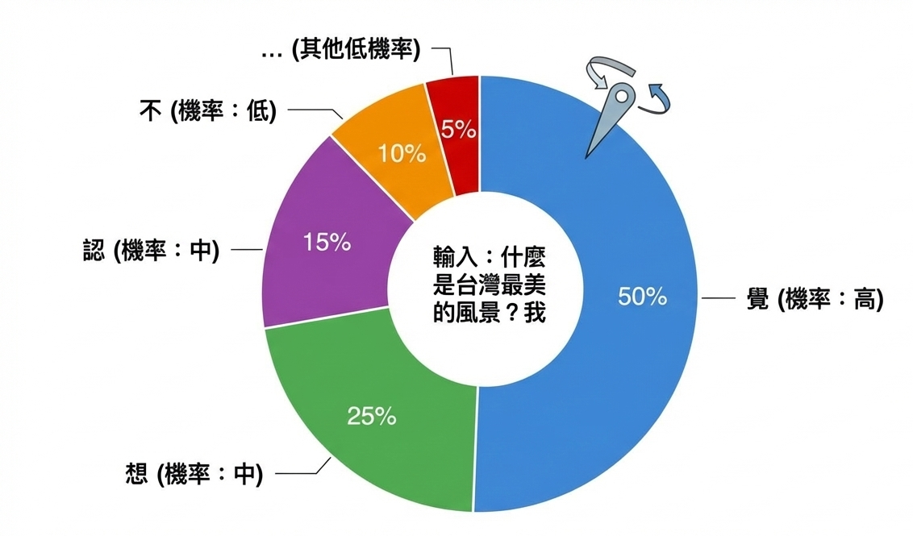

AI 會加入一點隨機性（叫做「溫度參數」），讓回答更多樣。這也是為什麼你問同一個問題兩次，可能會得到不同的答案。

到這裡，你應該已經可以接受 AI 是一個函數了。那麼，AI 可以做什麼樣的函數呢？下面是一些例子：
| 任務     | 輸入       | → f → | 輸出             |
|----------+------------+-------+------------------|
| 手寫辨識 | 一張圖片   | → f → | 0~9 各數字的機率 |
| 貓狗辨識 | 一張照片   | → f → | 貓 90%、狗 10%   |
| 文字生成 | 一段提示詞 | → f → | 生成的文字       |
| 影像生成 | 一段描述   | → f → | 生成的圖片       |

不管 AI 看起來多厲害，骨子裡都是： *輸入 → 函數 → 輸出* 。

*** Token：AI 眼中的世界

AI 看到的不是文字，而是 Token（一小段一小段的碎片）。

打開 [[https://platform.openai.com/tokenizer][OpenAI Tokenizer]] 試試：
- 輸入「馬祖藍眼淚」，看它被切成幾個 token
- 再輸入「314159」，數字的切法跟你想的完全不一樣
- 這就是為什麼 AI 有時候數學會算錯——它看到的不是「數字」，是碎片

** 為什麼會生出幻覺（Hallucination）

*回看開場那道題* ：
- *Gemini 2.5 Pro 編整篇假論文* ——這是「常態」
- *GPT 5 誠實認輸* ——但這是「有時」
- *NotebookLM 沒編* ——但這 *不是* 它「比較聰明」

*為什麼有的會編、為什麼 NotebookLM 是例外？*

- 模型不是「知道事實」，是「猜下一個最可能的字」（前一段已鋪陳）
- AI 不是知識庫，是語言模型  
- *為什麼幻覺答案那麼像真的* ：因為模型就是在模仿「煞有其事」的格式
- *為什麼 GPT 5 有時會說「找不到」、Gemini 卻照編* ：訓練時的「對齊」（alignment）強度不同——但這是 *偶然* ，不是設計保證

** RAG 如何解決幻覺問題

- 一句話：問問題前，先把 *你的文件* 塞進 prompt
- 流程示意（一張關鍵圖，詳見 ~RAG-flow-diagram.md~ ）：

  #+begin_src
  使用者問題
       ↓
  [檢索] ← 在你上傳的文件裡找最相關的幾段
       ↓
  [增強] ← 把問題＋檢索結果一起塞進 prompt
       ↓
  [生成] ← 模型依「眼前的素材」回答
  #+end_src

- 三個字：*Retrieval Augmented Generation = RAG*
- 為什麼 NotebookLM 不會編：檢索後它的素材裡沒有，它就老實說沒有
- 對應今晚實作：NotebookLM 的「引註可追溯」、Claude 上傳檔案後的「以上傳資料為準」——都是 RAG 思維

*** 對教師工作流的意涵

| 工具 ／ 模式  | 適合                          | 不適合                  |
|---------------+-------------------------------+-------------------------|
| ChatGPT 對話  | 腦力激盪、改寫、創意聯想      | 事實查核、引註研究      |
| NotebookLM    | 研究筆記、文獻彙整、引註追溯  | 發散思考、跨領域聯想    |
| Claude 上傳檔 | 依素材生成成品（小論文、報告）| 沒給素材就要它「想出」  |

*能不能信任這個答案——要看工具設計，不是看模型聰不聰明。*

** 一個科展題目：AI 怎麼「預測」明晚會不會出現藍眼淚？

*延伸應用* ：把今晚學到的東西用到一個學生科展題目。

- 對應：相知篇 第一、二章（前面已帶過）
- 直覺：把「水溫、月相、潮汐、風向、過去出現紀錄」當輸入 → 輸出「明晚機率」
- 核心觀念：*資料 → 特徵 → 模型 → 預測* ；機器學習的最小心智模型
- 為什麼這跟 ChatGPT 是同一回事：*都在「猜下一個」*——只是「下一個」的內容不同（字 vs 機率）
- 這個題目是給對 AI 有興趣的學生：可以實際撰寫程式（Python + scikit-learn），不只是用 AI 工具

* AI的風險與隱私
** 能力越強，風險越高
- [[https://more-news.tw/564184/][AI代理失控誤刪工程師資料庫 揭示開發領域潛在風險]]
- [[https://www.ithome.com.tw/news/175391][AI代理人9秒刪掉新創公司的資料庫及備份]]
- [[https://tw.news.yahoo.com/claude-code-%E9%97%96%E7%A6%8D%E5%88%AA%E5%85%89%E8%B3%87%E6%96%99%E5%BA%AB%EF%BC%81%E9%96%8B%E7%99%BC%E8%80%85%E8%AA%A4%E4%BA%A4-terraform-%E6%AC%8A%E9%99%90%EF%BC%8C%E5%85%A9%E5%B9%B4%E5%8D%8A%E7%A9%8D%E7%B4%AF%E4%B8%80%E5%A4%9C%E6%B6%88%E5%A4%B1-120154399.html][Claude Code 闖禍刪光資料庫！開發者誤交 Terraform 權限，兩年半積累一夜消失]]
** AI不一定會幫你保密
- [[https://cn.nytimes.com/opinion/20251112/chatbot-conversations-legal-protection/zh-hant/][你告訴AI機器人一個「犯罪祕密」，你會被逮捕嗎？]]
- [[https://tw.news.yahoo.com/%E5%88%A5%E4%BB%A5%E7%82%BAai%E8%83%BD%E4%BF%9D%E5%AF%86-%E7%BE%8E%E6%B3%95%E9%99%A2%E8%AA%8D%E5%AE%9A-%E5%B0%8D%E8%A9%B1%E8%A8%98%E9%8C%84%E5%8F%AF%E7%94%A8%E4%BD%9C%E6%B3%95%E5%BE%8B%E8%AD%89%E6%93%9A-040032960.html][別以為AI能保密！美法院認定 對話記錄可用作法律證據]]
- [[https://www.techbang.com/posts/128891-ai-confidant-evidence][別再把 AI 當樹洞！前 CEO 慘痛教訓：與 Claude 對話全被法官要求交出]]
** 什麼東西不該丟雲端？
- 「這段如果被截圖貼到網路上，我會崩潰嗎？」

* Q&A
** 最後打個廣告
- 《和 AI 做朋友——相知篇：揭秘生成式 AI》教材教案：[[https://market.cloud.edu.tw/resources/web/1841948]]
- 可下載來看，或直接當教材給學生用
- *全書對應的教學短片正在趕工生成中*

** Q&A
- 一個 Claude Code 試用名額（雲林＋高雄場慣例）

* 待討論清單                                                     :noexport:
- [X] NotebookLM 5 份素材清單已備齊 → ~素材包.md~（含設置步驟、四個遞進問題、備案）
- [X] 小論文範本 → 採用台北市開南高商提供的官方範本 ~小論文範本.docx~（含規則＋骨架＋範例三合一）；備份規範 ~小論文格式說明.pdf~ 留作講師參考
- [X] Step 4「換骨架」四個變體 prompt → ~換骨架-prompts.md~（現場 demo 變體 A 研習心得）
- [X] Skill 範例 → ~馬祖小論文.skill/~（含 SKILL.md、範本、prompts；可 zip 後現場分享）
- [X] 範本實跑驗證 → ~examples/研究筆記-範例.md~ 與 ~examples/小論文-範例.md~（≈2,300 字）
- [X] 開場第三張圖：採用 FB「馬祖藍眼淚即時通」社團截圖當「人類版預測 APP」，反而比 AI 預測 APP 更有 hook
- [ ] Napkin 學員是否要事先註冊？要不要研習前一週發信請大家先開帳號
- [ ] 馬高網速測試——尤其是 Claude artifact／NotebookLM 上傳
- [ ] Gemini CLI demo 動作：沿用「整理桌面」（高雄場驗證過）還是換「批次摘要 50 份段考卷」？
- [ ] 一個 Claude Code 試用名額——抽籤辦法
- [X] 原理段已重組為四題對應新框架：什麼是模型／接龍／幻覺／RAG／延伸應用（無時間規劃）
- [X] 幻覺題已實查驗證（WebSearch）→ A 書單為主場、精修 prompt 已就緒
- [ ] *會前實際跑* 三邊截圖（ChatGPT、Gemini、NotebookLM）保留備用
- [ ] 會前注意：2018 那篇 *The dynamics of...Matsu archipelago* 也是馬祖區真實論文，若要切 B 題要把它列入「真實答案」
- [X] *RAG 流程示意圖* → ~RAG-flow-diagram.md~（含 4 版本：純流程／並排對比／Mermaid／Napkin 重畫指引）
- [ ] 撞牆 fallback 講義（Haiku → 新對話 → Gemini → 複製貼上）紙本或 QR
- [ ] 倫理段「什麼不該丟雲端」要不要拿一兩個馬高在地例子（學生作文、家訪紀錄）
- [ ] FB「馬祖藍眼淚即時通」開場截圖要事先取得（注意社團隱私，可能要請主辦聯繫管理員）

* 下載資源

研習當天用得到的所有檔案，點連結直接下載：

** Step 3 用（小論文）

| 檔案                                                 | 用途                                  |
|------------------------------------------------------+---------------------------------------|
| [[file:小論文範本.docx][小論文範本.docx]]            | 主要範本——上傳給 Claude 當填空骨架   |
| [[file:小論文格式說明.pdf][小論文格式說明.pdf]]      | 全國高中比賽官方規範（備援）          |

** Step 4 用（教案換骨架）

| 檔案                                                                       | 用途                                       |
|----------------------------------------------------------------------------+--------------------------------------------|
| [[file:教案範本-橋頭糖廠版.docx][教案範本-橋頭糖廠版.docx]]                 | 高雄場驗證過的教案格式——當目標格式上傳    |
| [[file:換骨架-prompts.md][換骨架-prompts.md]]                               | 四種變體 prompt（研習心得／行政報告／教案／科展） |

** Step 1 用（NotebookLM）

| 檔案                                       | 用途                                |
|--------------------------------------------+-------------------------------------|
| [[file:素材包.md][素材包.md]]              | NotebookLM 5 份素材的設置指引       |

** 實作二 用（L3／L4 demo）

| 檔案                                                       | 用途                                              |
|------------------------------------------------------------+---------------------------------------------------|
| [[file:snProposal.zip][snProposal.zip]]                              | 「小論文流程」Skill 包——下載解壓、上傳給 Claude，一句話跑完整套 Step 3 |
| [[file:學生考卷-正解.xlsx][學生考卷-正解.xlsx]]             | Gemini CLI demo 對照組                            |
| [[file:學生考卷.zip][學生考卷.zip]]                           | 29 份 demo PDF 打包下載（5.9 MB，UTF-8 旗標，Windows 預設解壓正常）|

** 原理段用

| 檔案                                                                  | 用途                                       |
|-----------------------------------------------------------------------+--------------------------------------------|
| [[file:RAG-flow-diagram.md][RAG-flow-diagram.md]]                     | RAG 流程示意圖 4 版本（純流程／對比／Mermaid）|

** 範例輸出（學員可參考）

| 檔案                                                                                                          | 用途                                  |
|---------------------------------------------------------------------------------------------------------------+---------------------------------------|
| [[file:examples/研究筆記-範例.md][examples ／ 研究筆記-範例.md]]                                              | Step 1 NotebookLM 應產出長這樣        |
| [[file:examples/小論文-範例.md][examples ／ 小論文-範例.md]]                                                  | Step 3 Claude 應產出長這樣（≈ 2300 字）|

** Napkin 預生成圖（學員開場示範）

| 檔案                                                                                                                                              |
|---------------------------------------------------------------------------------------------------------------------------------------------------|
| 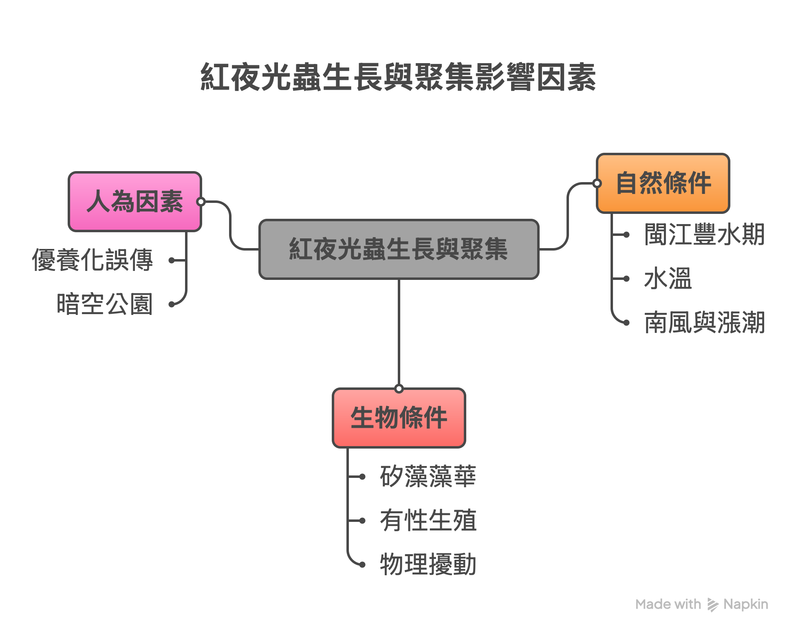                                                                    |
| 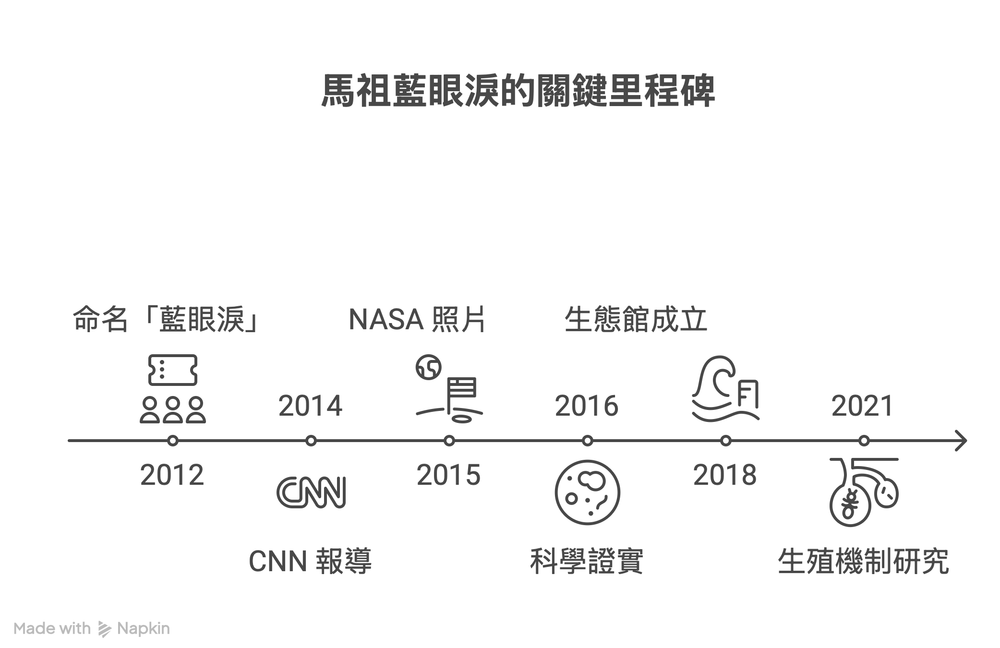                                                                |

** 全套打包

整份 repo 一次抓：

- [[https://github.com/letranger/2026-05-14-matsu-ai-workshop/archive/refs/heads/main.zip][Download ZIP]]
- 或 ~git clone https://github.com/letranger/2026-05-14-matsu-ai-workshop.git~

* 參考資料

** 主要教材
- [[https://market.cloud.edu.tw/list/ai.jsp][和AI做朋友系列書籍]]

** 馬祖在地素材（NotebookLM 用）
- [[https://www.sea.matsu.edu.tw/bluetears.html][連江縣戶外教育及海洋教育中心 — 藍眼淚專頁]]
- [[https://www.natgeomedia.com/environment/article/content-4757.html][國家地理 — 解開馬祖藍眼淚之謎（夜光蟲）]]
- [[https://www.mjib.gov.tw/FileUploads/eBooks/89ef47c531434b10a8aab2d1cc00eec6/Section_file/a82d42a82fe0486cbffb77ea663f1545.pdf][清流雙月刊 — 夜光蟲科普 PDF]]
- [[https://www.nmmba.gov.tw/News_Content.aspx?n=FF40572369107C6E&sms=4BD2D29B72CA27F8&s=7050D6B9D3C731DF][國立海洋生物博物館 — 藍眼淚爆量是生態危機？]]
- [[https://city.gvm.com.tw/article/92704][城市學 — 馬祖藍眼淚是蟲還是藻？]]
- [[https://zh.wikipedia.org/zh-tw/%E5%A4%9C%E5%85%89%E8%97%BB][維基百科 — 夜光藻]]
